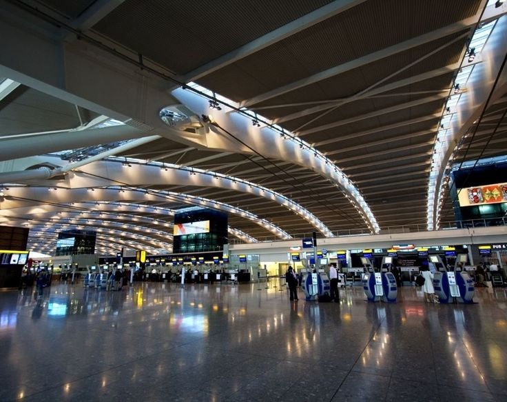
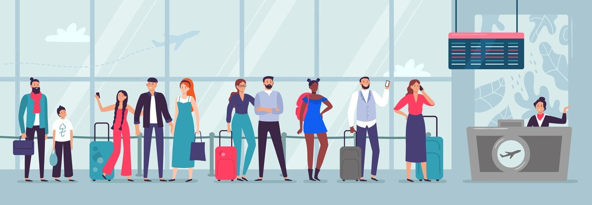
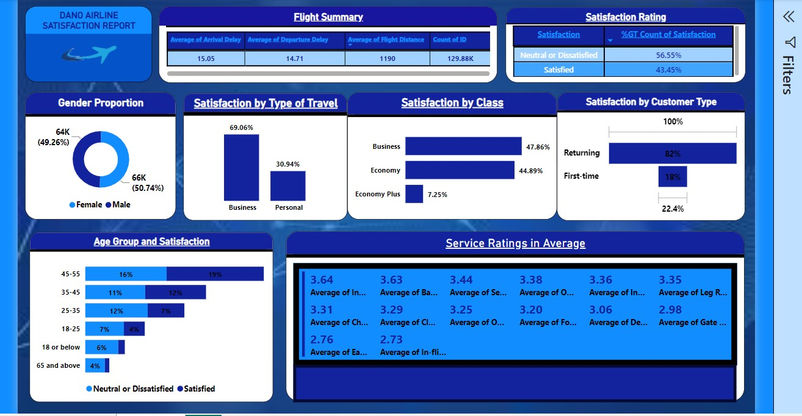

Dano Airlines Passenger Satisfaction Analysis
---
As the designated data analyst for Dano Airlines, a leading UK-based airline headquartered in London, I have conducted a comprehensive analysis of the latest passenger survey results. Regrettably, it has come to our attention that the overall satisfaction rate has fallen below 50%, marking the first instance of such a decline. Recognizing the urgency of the situation, I am poised to present key insights and strategic recommendations to the leadership team, enabling prompt and informed decision-making to address the challenges and enhance overall customer satisfaction.

---

----

## Introduction

The leadership team has tasked me with a challenge: to unravel the details of this decline and to provide actionable insights that will guide swift and effective measures to elevate our customer satisfaction. In the following analysis, I will present a meticulous examination of the survey data, unveiling the key areas that require strategic focus to navigate our airline back to a trajectory of heightened customer satisfaction.

**_Disclaimer_**: _The datasets and reports provided here are for illustrative purposes only and do not represent the data of any particular institution or organization. These are simulated datasets crafted exclusively to demonstrate the functionalities of Microsoft Power BI.

----

## Problem Statement

Customer satisfaction scores from 120,000+ airline passengers, including additional information about
each passenger, their flight, and type of travel, as well as their evaluation of different factors like
cleanliness, comfort, service, and overall experience.

---

## Data Model
 The project is accompanied by a single Excel file

 ---

## Visualization/Dashboard

---
 

 ---

 ## Recommendations For Management

 ---

1. Improve the overall satisfaction score. The overall satisfaction score is below 50%, which is a sign that the airline needs to make some significant improvements. The airline can start by identifying the key areas where passengers are most dissatisfied and then developing targeted strategies to address those areas.

2. Reduce flight delays. Flight delays are a major source of dissatisfaction for passengers. The airline can reduce flight delays by improving operational efficiency and investing in new technologies. For example, the airline could use predictive analytics to identify potential delays and take proactive measures to mitigate them.

3. Improve the satisfaction of first-time passengers. First-time passengers are more likely to be dissatisfied with their flying experience than returning passengers. The airline can improve the satisfaction of first-time passengers by providing them with more information about the flying process and offering additional assistance. For example, the airline could create a dedicated website for first-time passengers that provides information about check-in, security, and boarding.

4. Improve the satisfaction of economy-class passengers. Economy-class passengers are the largest customer segment for the airline, but they are also the least satisfied. The airline can improve the satisfaction of economy-class passengers by providing them with more legroom and better amenities, such as in-flight entertainment and Wi-Fi access. The airline could also consider offering more flexible seating options, such as the ability to reserve seats in advance.

5. Conduct additional surveys to better understand the reasons for low satisfaction among economy-class passengers. The airline can collect additional feedback from economy-class passengers using Google Form documentation to better understand the reasons for their dissatisfaction. This feedback can be used to develop targeted strategies to improve the satisfaction of this important customer segment.

---

## Additional Initiatives 

---
1. Create a customer loyalty program. A customer loyalty program can help improve customer satisfaction by rewarding passengers for their business. The airline could offer rewards such as free flights, upgrades, and access to exclusive lounges and amenities.

2. Improve customer service. Customer service is essential for creating a positive customer experience. The airline can improve customer service by training employees to be more friendly and helpful. The airline could also make it easier for passengers to contact customer service with questions or complaints.

3. Invest in social media. Social media is a powerful tool for engaging with customers and receiving feedback. The airline can use social media to communicate with passengers about flight delays, cancellations, and other important information. The airline can also use social media to collect feedback from passengers and identify areas for improvement.

----

## Conclusion

----
By implementing these recommendations, the airline can improve customer satisfaction and increase its chances of success in the competitive airline industry.

---
 
## Thank You
 ---
 
 
